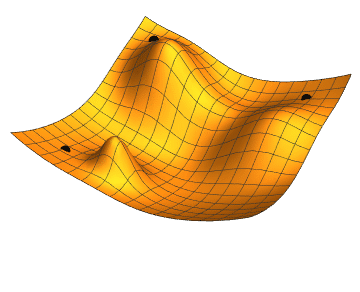

# The Gradient Descent Algorithm
This repository contains a custom implementation of the gradient descent algorithm applied to a logistic regression problem. The interactive notebook (.ipynb) provides a detailed example of how gradient descent works, along with a step-by-step breakdown of the implementation.

## Overview

-   Understand the inner workings of the gradient descent algorithm.
-   Implement gradient descent from scratch.
-   Apply the algorithm to solve a logistic regression problem.

## How Gradient Descent Works

Gradient descent is an iterative optimization algorithm used for finding the minimum of a function. In the context of machine learning, it is used to minimize a loss function to improve the performance of a model.

The basic idea behind gradient descent is as follows:

1.  **Initialize Parameters**: Start with initial values for the parameters of the model.
2.  **Calculate Gradient**: Compute the gradient (partial derivatives) of the loss function with respect to each parameter.
3.  **Update Parameters**: Adjust the parameters in the opposite direction of the gradient to minimize the loss.
4.  **Repeat**: Iterate steps 2 and 3 until convergence or a stopping criterion is met.

By following this process, gradient descent gradually moves towards the optimal set of parameters that minimizes the loss function.

## Usage

Feel free to use this code as a learning resource or as a starting point for your own projects. If you find it helpful, consider giving it a star! 🤩